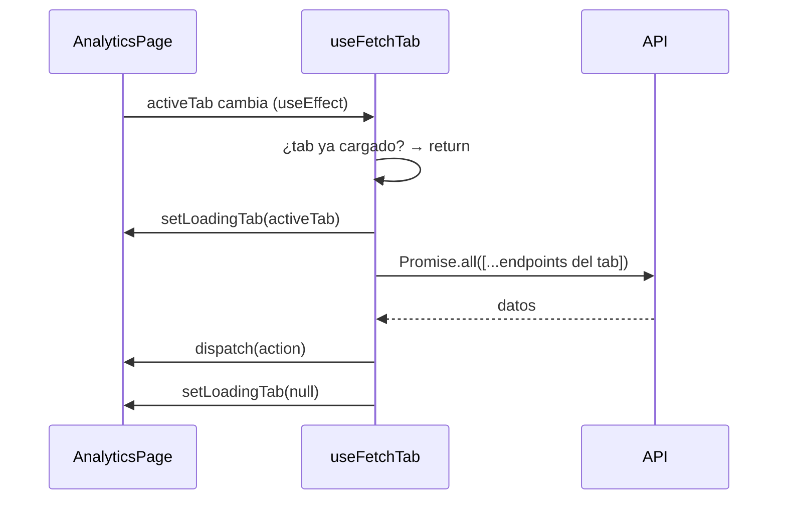
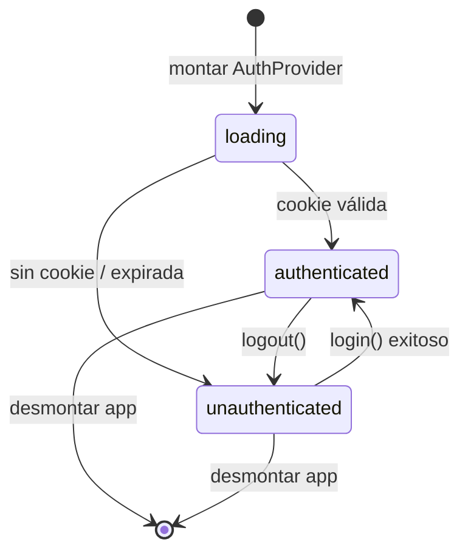

# Hooks y Contexto

Documenta los tres mecanismos de lógica reutilizable del frontend: los dos hooks personalizados
que gestionan estado derivado de red (`useDbStatus`, `useFetchTab`) y el contexto global de
autenticación (`AuthContext`) con sus funciones auxiliares de cookie.

---

## `useDbStatus`

**Archivo:** `frontend/src/hooks/useDbStatus.ts`

Monitoriza la salud de Neo4j consultando `GET /api/health` cada 15 segundos.
Cada llamada tiene un timeout de 4 segundos en el que si la API no responde, el estado pasa a
`"disconnected"` sin bloquear la UI.

```typescript
function useDbStatus(): "checking" | "connected" | "disconnected"
```

| Valor | Significado |
|---|---|
| `"checking"` | Estado inicial mientras llega la primera respuesta |
| `"connected"` | La API respondió con `200 OK` |
| `"disconnected"` | La petición falló o devolvió un código de error |

**Usado por:** `DbStatusBadge` (indicador visual) y `PipelinePage` (bloquea el botón de
ejecución si Neo4j no está disponible).

---

## `useFetchTab`

**Archivo:** `frontend/src/hooks/useFetchTab.ts`

Garantiza que cada pestaña de `/analytics` carga sus datos **exactamente una vez** por
sesión de página. Navegar de vuelta a una pestaña ya visitada reutiliza los datos del
reducer por lo que no lanza una nueva petición de red.

```typescript
function useFetchTab(
  activeTab:     number,
  dispatch:      Dispatch<AnalyticsAction>,
  setLoadingTab: (tab: number | null) => void,
): void
```

**Por qué una vez:** los datos analíticos son pre-computados en `data/export/` y no cambian
durante la sesión. Refetching en cada visita no aportaría datos más frescos y degradaría la
experiencia de navegación entre pestañas.

### Ciclo de vida



Las acciones del reducer y la forma completa del estado (`AnalyticsState`) están
documentadas en [Gestión de Estado](state.md).

---

## `AuthContext`

**Archivo:** `frontend/src/contexts/AuthContext.tsx`  
**Funciones auxiliares:** `frontend/src/lib/auth.ts`

El componente `AuthContext` centraliza la gestión de identidad en el frontend. 
Administra íntegramente el ciclo de vida del token JWT almacenándolo en una cookie HTTP 
(`auth_token`, `SameSite=Lax`, expiración de 24 horas), resolviendo su decodificación mediante 
métodos nativos (`atob`) para evitar dependencias de terceros, y propaga el estado de autorización 
a través del *hook* `useAuth()`.

**Justificación del mecanismo de persistencia (Cookie vs. `localStorage`)**
La elección de cookies frente al Web Storage responde a un requerimiento estricto del *App Router*. 
Dado que el `middleware.ts` de Next.js opera en el *Edge Runtime* (entorno de servidor), carece 
de acceso a las APIs del cliente como `localStorage` por lo que almacenar el JWT en una cookie permite 
interceptar la petición y validar la sesión en el servidor, ejecutando una redirección temprana a `/login` 
que erradica por completo cualquier parpadeo o exposición residual de la interfaz protegida.

### Interfaz del contexto

```typescript
interface AuthContextType {
  user:    AuthUser | null;   // null si no autenticado o token expirado
  loading: boolean;           // true durante el arranque inicial
  login:   (email: string, password: string) => Promise<void>;
  logout:  () => void;
}
```

### Funciones de cookie (`src/lib/auth.ts`)

| Función | Descripción |
|---|---|
| `getToken()` | Lee la cookie `auth_token` vía `document.cookie` |
| `setToken(token)` | Escribe la cookie con `path=/; max-age=86400; SameSite=Lax` |
| `clearToken()` | Expira la cookie con `max-age=0` |
| `decodeToken(token)` | Decodifica el payload del JWT |
| `isTokenExpired(payload)` | Compara `payload.exp * 1000` con `Date.now()` |

### Comportamiento

Al montar, `AuthProvider` verifica la cookie de forma que si existe y no está expirada, reconstruye
`user` desde el payload, pero si está expirada llama a `clearToken()`. `login()` escribe la
cookie y redirige a `/` mientras que `logout()` la expira con `max-age=0` y redirige a `/login`.



### Uso

```typescript
import { useAuth } from "@/contexts/AuthContext";

function MyComponent() {
  const { user, loading, login, logout } = useAuth();

  // Esperar a que se resuelva la cookie antes de renderizar
  if (loading) return null;

  // user es null si no hay sesión activa
  if (!user) return <Redirect to="/login" />;

  return <p>Bienvenido, {user.full_name ?? user.email}</p>;
}
```

El componente debe estar dentro de `AuthProvider` (montado en `app/layout.tsx`).
Usar `loading` evita destellos de contenido mientras el contexto verifica la cookie
en el arranque por lo que renderizar condicionalmente hasta que `loading` sea `false` garantiza
que `user` tiene su valor definitivo.

> **Ver también:** [Visión General → Flujo de una petición autenticada](overview.md#flujo-de-una-peticion-autenticada) para el diagrama de secuencia completo cookie → middleware → redirección.