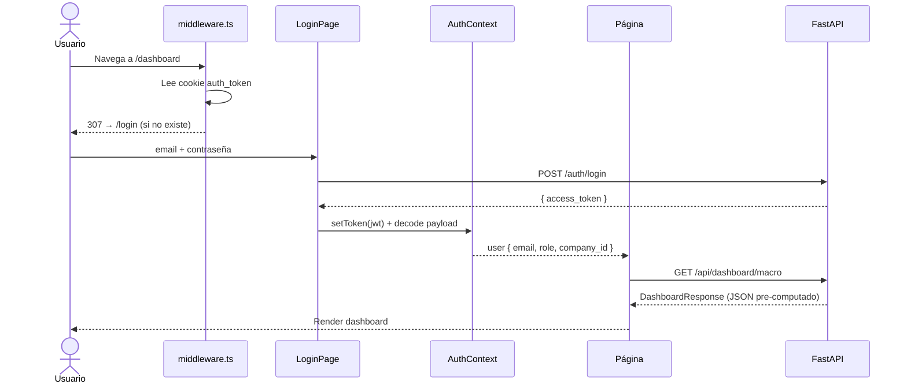

# Visión General del Frontend

El frontend es una interfaz analítica construida con Next.js orientada a gestores de redes 
de suministros. Su responsabilidad es gestionar la visualización de los resultados del 
pipeline ETL y operar el sistema sin exponer la complejidad de la base de datos de grafos 
al usuario final.

---

## Stack tecnológico

| Tecnología | Capa | Justificación Arquitectónica |
|---|---|---|
| Next.js (App Router) | Framework Core | Enrutamiento nativo y middleware Edge para protección de rutas por JWT. |
| TypeScript | Lenguaje | Garantiza coherencia entre los contratos de la API y los tipos del frontend. |
| Tailwind CSS | Estilos | Prototipado ágil y sistema de diseño consistente mediante utilidades. |
| Recharts | Visualización | Base SVG sobre la que se construyen las 8 primitivas gráficas del dashboard. |
| Sonner | Notificaciones | Feedback inmediato al usuario tras mutaciones de estado en la UI. |

---

## Roles de usuario

El sistema implementa dos roles que condicionan la visibilidad de rutas y funcionalidades:

| Rol | Acceso actual | Descripción |
|---|---|---|
| `company_user` | Dashboard, Analítica | Usuario vinculado a una empresa de la red |
| `admin` | Todo lo anterior + Pipeline | Puede lanzar y configurar el pipeline ETL |

La intención de diseño para `company_user` es que vea únicamente los datos relativos a su propia empresa como sus 
relaciones de suministro, sus documentos y la posibilidad de modificar el estado de estos últimos. Actualmente 
la página `/company` está pensada para desarrollos futuros, por lo que no está accesible ni visible para los usuarios. 
Aunque el sistema de login permite el acceso de este tipo de usuarios, la interfaz específica para ellos aún no está 
desarrollada y se muestra la misma que para los usuarios administradores.

---

## Decisiones de arquitectura

### Interfaz interactiva y delegación de renderizado

Dado el alto grado de interactividad requerido para la visualización analítica 
(gráficos dinámicos, gestión de pestañas y *polling* de estado), la capa de presentación 
opera íntegramente como componentes de cliente (`"use client"`). 

El único procesamiento en servidor es el middleware de autenticación (middleware.ts), 
que intercepta cada petición en el Edge y verifica la cookie auth_token antes de que 
se renderice ninguna ruta protegida.

### Desacoplamiento de lecturas: Pre-computado vs. Tiempo real

Para maximizar el rendimiento y proteger el motor de la base de datos, la arquitectura 
implementa un patrón de desacoplamiento entre las lecturas analíticas y el grafo. 
La inmensa mayoría de los indicadores se sirven como **datos pre-computados** donde el 
backend procesa durante la fase analítica los datos y almacena los resultados 
en artefactos estáticos JSON (`data/export/`). Esto garantiza tiempos de carga instantáneos 
en el frontend y evita saturar Neo4j con consultas analíticas pesadas durante la navegación rutinaria.

El acceso directo a Neo4j queda restringido a dos casos de uso puntuales:

- **`/api/health`**: Monitorización en vivo del estado de la conexión con la BD.
- **`/api/pipeline/*`**: Orquestación del pipeline ETL, donde el estado cambia durante la ejecución y no puede ser cacheado.

En consecuencia, el refresco de los datos visualizados no depende de la navegación 
del usuario, sino de la re-ejecución explícita del comando `analyze` en el pipeline.

### Encapsulación del sistema de visualización

El proyecto define ocho primitivas gráficas (BarChart, RingChart, TreemapChart, 
etc.) en components/charts/ que actúan como única interfaz hacia Recharts. 
En consecuencia, los componentes de negocio nunca importan la librería directamente.

Estas primitivas ocultan la complejidad de configuración (ejes, *tooltips*, contenedores 
*responsive* y paletas semánticas) y exponen una API mínima y fuertemente tipada. Esto centraliza la 
lógica de presentación, permitiendo modificar el estilo o el comportamiento de un tipo de gráfico en 
todo el proyecto editando un único fichero.

---

## Estructura de carpetas

```
frontend/src/
├── app/                        # Rutas (App Router de Next.js)
│   ├── layout.tsx              # Root layout: AuthProvider + SidebarLayout + Toaster
│   ├── middleware.ts           # Protección de rutas por cookie JWT
│   ├── login/page.tsx          # Autenticación
│   ├── page.tsx                # Dashboard principal
│   ├── analytics/page.tsx      # Analítica avanzada (7 pestañas)
│   ├── company/page.tsx        # Perfil y documentos de la empresa
│   ├── pipeline/page.tsx       # Control del pipeline ETL (solo admin)
│   └── docs/page.tsx           # Documentación técnica interna
├── components/
│   ├── analytics/              # Una subcarpeta por pestaña de analítica
│   ├── auth/                   # Pantalla de login y animación de red
│   ├── charts/                 # Ocho primitivas de gráfico reutilizables
│   ├── dashboard/              # Widgets del dashboard principal
│   ├── pipeline/               # Secciones del formulario de pipeline
│   └── ui/                     # Sidebar, TopBar, StatCard, LoadingState, …
├── contexts/
│   └── AuthContext.tsx         # Estado global de autenticación
├── hooks/
│   ├── useFetchTab.ts          # Carga lazy y memoizada por pestaña
│   └── useDbStatus.ts          # Polling de salud de Neo4j cada 15 s
├── lib/
│   ├── api.ts                  # authFetch - wrapper de fetch con cabecera JWT
│   ├── auth.ts                 # Helpers de cookie: getToken, setToken, decodeToken
│   ├── analytics.ts            # Formatters EUR, badges semánticos por umbral
│   └── brand.ts                # Constante BRAND con nombre y capacidades
└── types/                      # Contratos TypeScript con el backend
    ├── auth.ts                 # AuthUser, TokenPayload
    ├── dashboard.ts            # MacroStats, TemporalSeriesRow, DashboardResponse
    ├── analytics.ts            # 20+ interfaces de analítica
    └── pipeline.ts             # PipelineFormData, StatusState
```

---

## Flujo de una petición autenticada

El acceso a rutas protegidas opera mediante un modelo de validación en dos fases. 
A nivel de infraestructura, el middleware intercepta la petición en el *Edge* para 
verificar la cookie. Si no existe, ejecuta una redirección temprana a `/login`, evitando 
renderizados innecesarios. A nivel de aplicación, una vez superada esta barrera, el `AuthContext` 
reconstruye el estado del cliente decodificando el JWT, lo que habilita la inyección automática del 
token en las cabeceras de autorización para las subsecuentes peticiones al backend.



---

## Configuración y comandos de desarrollo

### Orden de arranque en local

Requiere Node.js 18+, Docker y Python instalados. Los tres servicios deben levantarse en este orden:

1. `docker compose up -d neo4j` - solo Neo4j en local (puerto 7687)
2. API (puerto 8000) - dos opciones según el flujo de trabajo:
    - `python -m uvicorn backend.api.main:app --reload` - recomendado si se desarrolla el backend ya que recarga automáticamente ante cambios en el código
    - `docker compose up -d backend` - válido si solo se trabaja en el frontend ya que no tiene hot-reload y requiere `docker compose restart backend` tras modificaciones
3. `npm run dev` — Frontend (puerto 3000)

Si el backend no está activo al cargar el dashboard, `DbStatusBadge` mostrará
estado desconectado y las páginas de analítica no tendrán datos.

### Variable de entorno

| Variable | Descripción | Valor por defecto |
|---|---|---|
| `NEXT_PUBLIC_API_URL` | URL base de la API FastAPI | `http://localhost:8000` |

Solo es necesario en producción, donde debe definirse como variable de entorno del contenedor.

### Comandos

```bash
cd frontend && npm install

npm run dev      # servidor de desarrollo → http://localhost:3000
npm run build    # build de producción
npm start        # sirve el build de producción
npm run lint     # ESLint
```