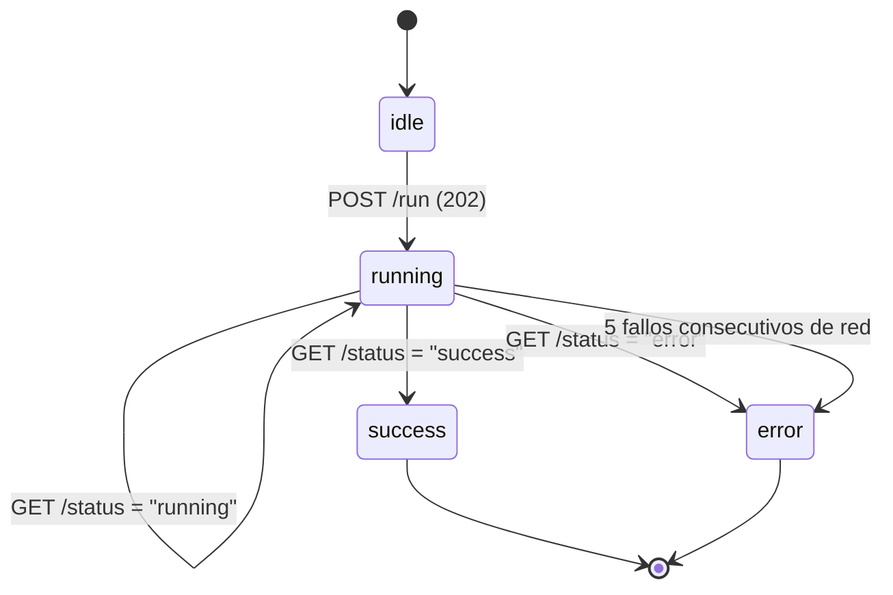

# Páginas

La capa de presentación expone seis rutas gestionadas mediante el App Router de Next.js,
divididas lógicamente en cuatro dominios funcionales: núcleo analítico, control de flujos de datos, 
identificación y soporte, y desarrollos futuros.

Todas las rutas comparten un layout raíz (`app/layout.tsx`) que orquesta el contexto de
autenticación (`AuthProvider`), la estructura de navegación (`SidebarLayout`) y el sistema
global de notificaciones (`Toaster`). Este diseño asegura que la infraestructura base no
se duplique a lo largo de las distintas páginas del sistema.

---

## Núcleo Analítico

Las pantallas que consumen el grafo y responden a las preguntas de negocio. Constituyen
el valor principal del sistema.

### `/` — Dashboard principal

**Archivo:** `app/page.tsx`  
**Endpoint:** `GET /api/dashboard/macro` → `DashboardResponse`

El propósito central de esta vista es proporcionar un diagnóstico macroscópico sobre el estado 
operativo y la integridad de la red de suministro. Para estructurar esta información, la interfaz 
presenta tres niveles de profundidad analítica:

1. **Totales de red** — KPIs de nodos, aristas y volumen económico con tendencia mensual
2. **Evolución temporal** — gráfico de área de documentos + volumen € con selector de rango
3. **Distribución** — gráfico de anillo por tipo de documento y rankings de proveedores/compradores

Un cuarto bloque muestra las métricas de topología libre de escala (Gini, hubs) para validar
que el grafo sintético tiene una distribución de grados realista.

La página tiene tres estados de renderizado: `LoadingState` mientras llega la respuesta,
`ErrorState` si la API no responde, y `EmptyState` si el grafo está vacío y en ese caso,
solo los usuarios `admin` ven el botón de acceso al pipeline.

**Datos de `MacroStats` → widget:**

| Campo | Widget |
|---|---|
| `node_counts` / `relationship_counts` | KPIs superiores |
| `economic_volume` / `document_health` | KPIs de salud de la red |
| `doc_type_counts` | Gráfico de anillo |
| `top_suppliers` / `top_buyers` | Listas de barras de ranking |
| `scale_free_metrics` | Sección de topología libre de escala |
| `temporal_series` | Gráfico de área + tendencias de las tarjetas KPI |

### `/analytics` — Analítica avanzada

**Archivo:** `app/analytics/page.tsx`

Este módulo actúa como el motor de *Business Intelligence* del sistema, estructurado en siete 
paneles temáticos diseñados para resolver fricciones operativas específicas. El estado de 
navegación delega el índice de la pestaña activa directamente a la URL mediante el parámetro 
`?tab=N`. Esta decisión arquitectónica habilita el *deep linking* (p. ej., `/analytics?tab=5` 
para enlazar directamente a Trazabilidad) y mantiene la coherencia bidireccional con el historial 
del navegador.

A nivel de rendimiento, el componente implementa un patrón de hidratación eficiente donde el *hook* 
`useFetchTab` garantiza que los datos de cada panel se obtengan de la API exactamente una vez 
por sesión, evitando peticiones redundantes al conmutar entre pestañas previamente visitadas.

**Dominios analíticos y objetivos de evaluación:**

| Tab | Dominio | Criterio de Evaluación (*Business Question*) |
|---|---|---|
| 0 | Contratos | ¿Qué arquetipos contractuales dominan la red y cuál es su grado de exclusividad? |
| 1 | Riesgo | ¿Qué nodos proveedores concentran el suministro y qué compradores presentan mayor fragilidad estructural? |
| 2 | Discrepancias | ¿Qué proveedores presentan mayor incidencia de errores y cómo impactan en la facturación? |
| 3 | Lead Time | ¿Qué categorías de producto sufren retrasos sistemáticos en su ciclo de distribución? |
| 4 | Exposición | ¿Cuál es el volumen de capital bloqueado en facturas pendientes o con plazos vencidos? |
| 5 | Trazabilidad | ¿Cuál es el linaje documental exacto desde un pedido origen hasta una anomalía de facturación? |
| 6 | GDS | ¿Qué entidades actúan como cuellos de botella sistémicos y qué comunidades logísticas emergen en la red? |

> **Nota de Integración:** La relación exhaustiva de *endpoints* consumidos por cada panel y las mutaciones 
    de estado asociadas se encuentran documentadas en la sección [Gestión de Estado → Acciones disponibles](state.md#acciones-disponibles).

---

## Orquestación y Control de Infraestructura

Este dominio funcional actúa como el centro de mando del sistema, agrupando las interfaces 
que ejecutan mutaciones de estado en el grafo y administran la infraestructura de datos.

### `/pipeline` — Control del pipeline ETL

**Archivo:** `app/pipeline/page.tsx`  
**Solo visible para:** usuarios con `role === "admin"`  
**Endpoints:** `POST /api/pipeline/run` (202), `GET /api/pipeline/status`

Interfaz dedicada a la parametrización del motor de generación de redes sintéticas. Para garantizar 
la consistencia de las operaciones, el componente implementa un mecanismo de seguridad preventiva a 
nivel de UI en el que deshabilita de forma automática la capacidad de ejecución si el *hook* `useDbStatus` 
detecta la pérdida de conectividad con el motor Neo4j.

Al inicializar el proceso de generación, el cliente delega la carga computacional pesada al backend (que 
confirma la recepción mediante un HTTP 202 Accepted) y transiciona hacia una estrategia de *short-polling*, 
donde la interfaz consulta periódicamente el estado de la tarea en intervalos de 5 segundos hasta recibir 
una señal definitiva de resolución.

**Sistema de estados de la ejecución:**

**Parámetros del formulario** — ver `PipelineFormData` en [Contratos de API](types.md) para
la descripción de cada campo LFR.

---

## Acceso y Soporte

Este dominio agrupa los módulos transversales que proporcionan soporte operativo, control de acceso 
y documentación técnica, garantizando la usabilidad y seguridad integral del sistema.

### `/login` — Autenticación

**Archivo:** `app/login/page.tsx`  
**Endpoint:** `POST /auth/login`

La interfaz de acceso implementa un diseño de doble panel. El espacio de identidad corporativa integra una 
representación SVG animada de la topología B2B para contextualizar el dominio analítico, mientras que el 
panel interactivo gestiona el formulario de credenciales.

A nivel de flujo de autorización, una autenticación exitosa culmina con la persistencia estricta del token JWT 
en la cookie `auth_token`. Para optimizar el rendimiento y la seguridad visual, el sistema opera de forma preventiva 
por lo que si un usuario con una sesión válida intenta acceder a esta ruta, el *middleware* lo intercepta en el servidor 
y ejecuta una redirección inmediata hacia el panel principal, omitiendo el renderizado del formulario.

### `/docs` — Documentación técnica interna

**Archivo:** `app/docs/page.tsx`

Este módulo expone una referencia técnica autocontenida y compilada estáticamente dentro del código cliente (JSX), 
eliminando por completo la latencia de red (*zero-fetch*). Su propósito es proporcionar soporte contextual ininterrumpido, 
permitiendo al operador auditar la lógica del sistema sin abandonar el entorno de trabajo.

La guía se vertebra mediante anclas de navegación a través de siete ejes de conocimiento (Arquitectura, Modelo de Datos, 
Pipeline y modelo LFR, Guía Analítica, Especificación de API, Consultas Cypher y Despliegue). Para maximizar la ergonomía 
de lectura, el índice lateral (TOC) implementa un mecanismo de *scroll-spy* basado en la API nativa `IntersectionObserver`, 
que rastrea y actualiza algorítmicamente la sección activa en pantalla durante la navegación vertical.

---

## Desarrollos Futuros

Este dominio documenta los puntos de extensión arquitectónica proyectados para 
iteraciones posteriores del sistema, delimitando el alcance operativo de la versión actual.

### `/company` — Perfil de empresa

**Archivo:** `app/company/page.tsx`

Módulo diseñado exclusivamente para operadores corporativos (`company_user`). Aunque 
su interfaz permanece inactiva en el despliegue actual, el archivo consolida la estructura 
necesaria para dotar al sistema de capacidades de interacción directa con sus datos.

**Alcance Funcional Previsto:**
- Exposición y actualización controlada del perfil de la compañía.
- Auditoría bidireccional de la trazabilidad documental (archivos enviados y recibidos).
- Manipulación de los datos transaccionales de los documentos.

A nivel de infraestructura, la arquitectura ya está preparada para la implementación de este módulo. Los 
*endpoints* que soportan estas operaciones de lectura y escritura ya forman parte del motor REST, 
dejando la capa de presentación desacoplada y lista para su consumo en la próxima versión mayor del sistema.
