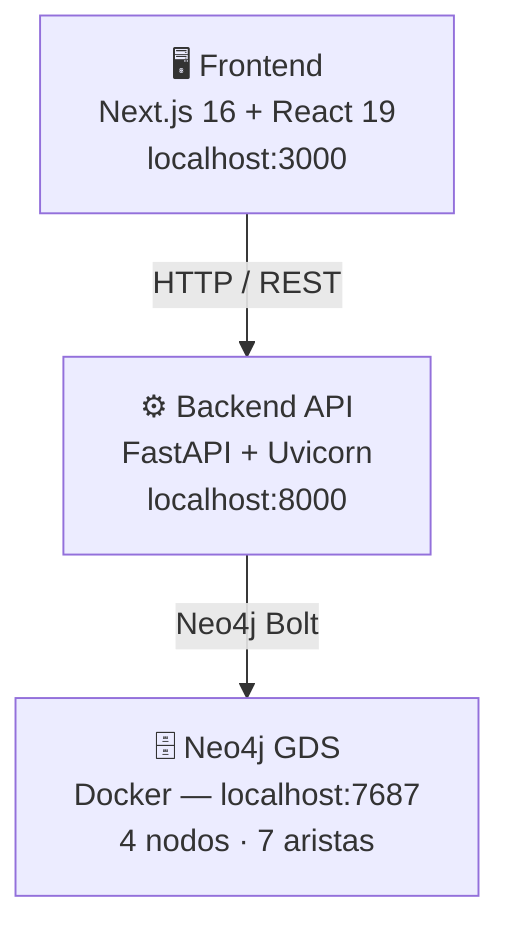

# B2B Graph Intel — Manual del Desarrollador

Sistema de análisis de redes de suministro B2B mediante grafos, generación sintética de datos
y algoritmos de Graph Data Science (GDS). Desarrollado como Trabajo de Fin de Grado en la Universidad de Burgos.

---

## Arquitectura de tres capas



---

## Stack tecnológico

| Capa | Tecnología | Versión |
|---|---|---|
| Frontend | Next.js + React | 16 / 19 |
| Estilos | Tailwind CSS | 4 |
| Gráficos | Recharts | 3 |
| Backend API | FastAPI + Uvicorn | última estable |
| Base de datos | Neo4j Enterprise + GDS | 5.x |
| Contenedores | Docker + Compose | — |
| Auth | JWT (HS256) + SQLite | — |
| Datos sintéticos | LFR Community Detection | — |

---

## Inicio rápido

```bash
# 1. Levantar Neo4j con plugin GDS incluido
docker compose up -d

# 2. Instalar dependencias Python
pip install -r requirements.txt

# 3. Pipeline completo (genera 300 empresas, carga y analiza)
python backend/main_cli.py all --rows 300 --clear-db --seed 42

# 4. API REST
python -m uvicorn backend.api.main:app --reload --host 0.0.0.0 --port 8000

# 5. Frontend
cd frontend && npm install && npm run dev
```

Neo4j Browser: [http://localhost:7474](http://localhost:7474) — usuario `neo4j` / contraseña `AdminUser1234`

Dashboard: [http://localhost:3000](http://localhost:3000)

---

## Guía de navegación

| Sección | Contenido |
|---|---|
| **Backend › Núcleo** | `Settings`, variables de entorno, funciones de utilidad |
| **Backend › API** | Aplicación FastAPI, modelos Pydantic, 23 endpoints REST |
| **Backend › Pipeline ETL** | Runners de orquestación, 5 sintetizadores, cargador Neo4j |
| **Backend › Analítica** | `B2BGraphAnalyzer` con sus 4 mixins y 20 métodos |
| **Backend › Autenticación** | Modelo de usuario SQLite + seeding de demo |
| **Frontend › Páginas** | 6 rutas: `/`, `/analytics`, `/company`, `/pipeline`, `/docs`, `/login` |
| **Frontend › Componentes** | 50+ componentes: charts, UI, dashboard, analytics, pipeline, auth |
| **Frontend › Hooks y Contexto** | `useDbStatus`, `useFetchTab`, `AuthContext` |
| **Frontend › Estado** | `useReducer`, cookie JWT, URL params (`?tab=N`) |
| **Base de Datos** | Consultas Cypher de referencia para trazabilidad, GDS y riesgo |
| **Despliegue** | Checklist de servidor + runbook de operaciones en producción |